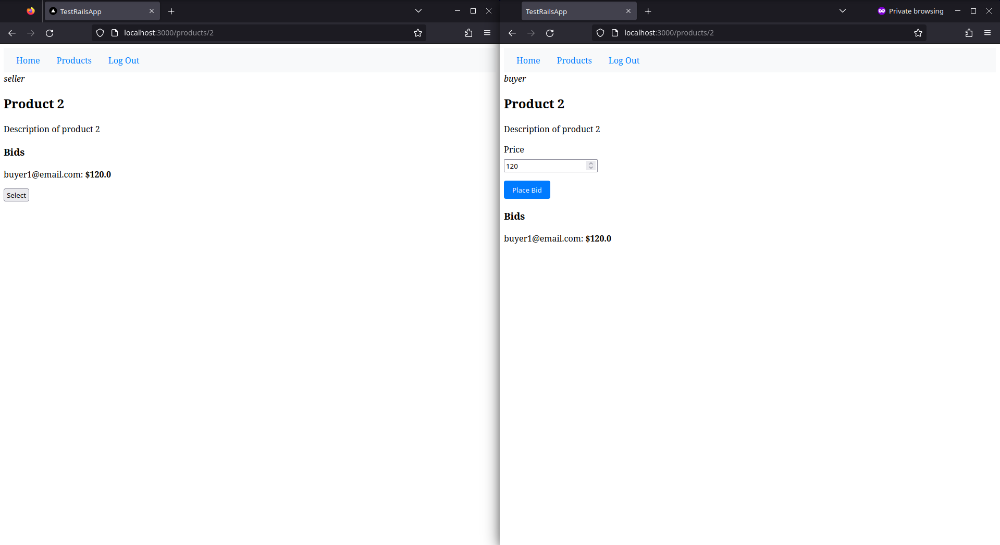

# Ruby on Rails app

In this real-time auction app, you can log in as a *buyer* or *seller*. Check the
`db/seeds.rb` file for sample data (including the user email and password). Buyers
can place bids on products, and the bids will show up in real-time. The seller can
select a bid from all the submitted bid, and the selection will be updated in
real-time, as well.



This application has been tested with the following:

1. Ruby 3.3.0
2. Rails 7.1.3

It is highly recommended that you use the above versions

# How to run this app?

Firstly clone the repository:

```sh
git clone https://github.com/chitramdasgupta/Rails-Auction-App.git
```

Then `cd` into the directory:

```sh
cd Rails-Auction-App/
```

Then you need to install the dependencies:

```sh
bundle install
```

And set up the database:

```sh
rails db:create
```

```sh
rails db:migrate
```

And also seed the database so that the sample data is available in the application:

```sh
rails db:seed
```

Finally run the server:

```sh
rails server
```

Then, open `http://localhost:3000/` in your web browser
